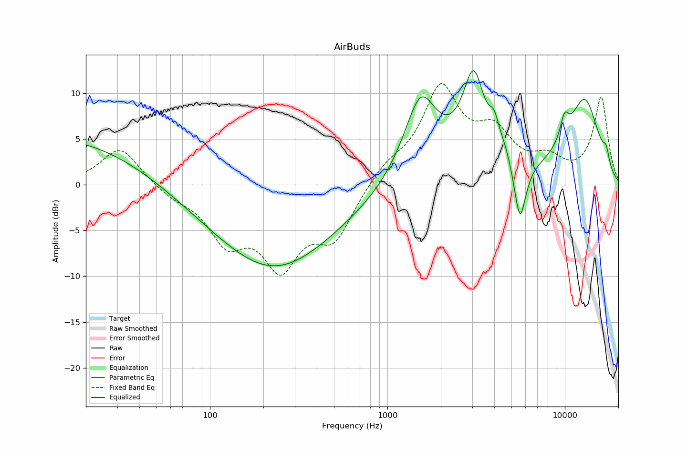

# AirBuds
See [usage instructions](https://github.com/jaakkopasanen/AutoEq#usage) for more options and info.

### Parametric EQs
In case of using parametric equalizer, apply preamp of **-12.70dB** and build filters manually
with these parameters. The first 5 filters can be used independently.
When using independent subset of filters, apply preamp of **-12.49 dB**.

| Type    | Fc          |    Q | Gain     |
|--------:|------------:|-----:|---------:|
| Peaking | 11.85 Hz    | 0.26 | 5.26 dB  |
| Peaking | 227.89 Hz   | 0.4  | -9.23 dB |
| Peaking | 1538.06 Hz  | 1.42 | 9.64 dB  |
| Peaking | 3059.16 Hz  | 2.09 | 10.41 dB |
| Peaking | 13164.70 Hz | 0.83 | 7.65 dB  |
| Peaking | 4190.73 Hz  | 3.64 | 3.32 dB  |
| Peaking | 5657.25 Hz  | 3.42 | -6.90 dB |
| Peaking | 6726.93 Hz  | 2.55 | 0.93 dB  |
| Peaking | 9685.55 Hz  | 3.4  | 2.04 dB  |
| Peaking | 18661.09 Hz | 1.57 | 1.71 dB  |

### Fixed Band EQs
In case of using fixed band (also called graphic) equalizer, apply preamp of **-11.26dB**
(if available) and set gains manually with these parameters.

| Type    | Fc          |    Q | Gain     |
|--------:|------------:|-----:|---------:|
| Peaking | 31.25 Hz    | 1.41 | 4.28 dB  |
| Peaking | 62.50 Hz    | 1.41 | -1.08 dB |
| Peaking | 125.00 Hz   | 1.41 | -5.45 dB |
| Peaking | 250.00 Hz   | 1.41 | -8.00 dB |
| Peaking | 500.00 Hz   | 1.41 | -5.36 dB |
| Peaking | 1000.00 Hz  | 1.41 | 1.76 dB  |
| Peaking | 2000.00 Hz  | 1.41 | 10.10 dB |
| Peaking | 4000.00 Hz  | 1.41 | 4.71 dB  |
| Peaking | 8000.00 Hz  | 1.41 | 2.03 dB  |
| Peaking | 16000.01 Hz | 1.41 | 8.63 dB  |

### Graphs
