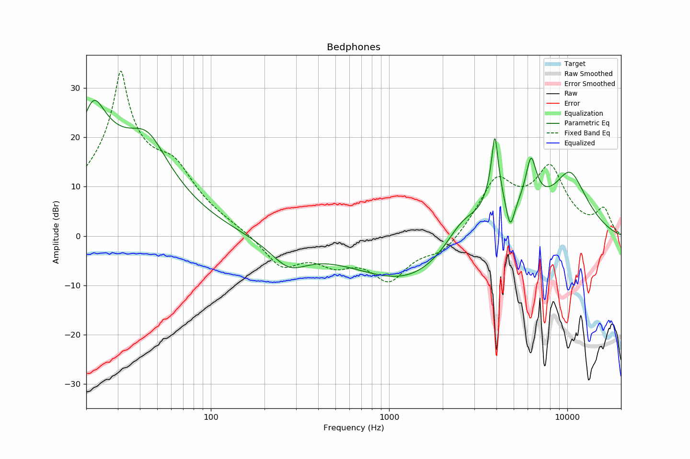

# Bedphones
See [usage instructions](https://github.com/jaakkopasanen/AutoEq#usage) for more options and info.

### Parametric EQs
In case of using parametric equalizer, apply preamp of **-29.16dB** and build filters manually
with these parameters. The first 5 filters can be used independently.
When using independent subset of filters, apply preamp of **-29.20dB**.

| Type    | Fc          |      Q | Gain     |
|:--------|:------------|:-------|:---------|
| Peaking | 22.56 Hz    | 1.003  | 23.94 dB |
| Peaking | 44.55 Hz    | 1.0124 | 12.35 dB |
| Peaking | 3921.14 Hz  | 5.7872 | 16.50 dB |
| Peaking | 6252.05 Hz  | 4.115  | 10.06 dB |
| Peaking | 10310.96 Hz | 1.0517 | 12.15 dB |
| Peaking | 273.37 Hz   | 1.3182 | -4.96 dB |
| Peaking | 1316.29 Hz  | 0.4186 | -9.69 dB |
| Peaking | 2573.19 Hz  | 1.4166 | 5.29 dB  |
| Peaking | 4019.80 Hz  | 0.7355 | 4.39 dB  |
| Peaking | 4775.38 Hz  | 5.5445 | -6.08 dB |

### Fixed Band EQs
In case of using fixed band (also called graphic) equalizer, apply preamp of **-33.92dB**
(if available) and set gains manually with these parameters.

| Type    | Fc          |      Q | Gain     |
|:--------|:------------|:-------|:---------|
| Peaking | 31.25 Hz    | 1.4142 | 31.74 dB |
| Peaking | 62.50 Hz    | 1.4142 | 6.43 dB  |
| Peaking | 125.00 Hz   | 1.4142 | 0.02 dB  |
| Peaking | 250.00 Hz   | 1.4142 | -6.51 dB |
| Peaking | 500.00 Hz   | 1.4142 | -4.38 dB |
| Peaking | 1000.00 Hz  | 1.4142 | -8.20 dB |
| Peaking | 2000.00 Hz  | 1.4142 | -3.60 dB |
| Peaking | 4000.00 Hz  | 1.4142 | 10.65 dB |
| Peaking | 8000.00 Hz  | 1.4142 | 12.66 dB |
| Peaking | 16000.01 Hz | 1.4142 | 4.90 dB  |

### Graphs
